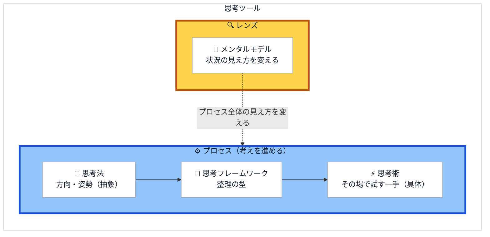

# awesome-thinking

「思考」に関するメンタルモデル・思考法・思考フレームワーク・思考術を、Markdown で整理するリポジトリです。

## 4タイプの違い

「貯金ができない」という問いで、4タイプの使い方を比べます。

| タイプ | グループ | 役割 | この例で使う思考 | 例での使い方 | 一覧 |
| --- | --- | --- | --- | --- | --- |
| 🧠 メンタルモデル | 🔍 レンズ | 見え方を変える | [機会費用](./thinking-mental-models/opportunity-cost.md) | 今の出費を、将来の選択肢を手放すことだと捉え直す | [一覧](./thinking-mental-models/index.md) |
| 🌊 思考法 | ⚙️ プロセス | 考える方向・姿勢を定める | [クリティカルシンキング](./thinking-methods/critical-thinking.md) | そもそも貯金額が目的なのか、何のために貯めるのかを問う | [一覧](./thinking-methods/index.md) |
| 🧩 思考フレームワーク | ⚙️ プロセス | 情報を整理する型を与える | [なぜなぜ分析](./thinking-frameworks/5-whys.md) | 「なぜ貯まらないか」を繰り返し、原因を掘り下げる | [一覧](./thinking-frameworks/index.md) |
| ⚡ 思考術 | ⚙️ プロセス | その場で試す一手を与える | [ゼロベース思考](./thinking-skills/zero-based-thinking.md) | 支出を白紙に戻し、ゼロから組むなら何に使うかを考える | [一覧](./thinking-skills/index.md) |

4タイプは、**レンズ**と**プロセス**の2グループに分かれます。

レンズに属するメンタルモデルは、手順を持たず、状況の見え方を変える視点です。

プロセスに属する思考法・思考フレームワーク・思考術は、考えを進める道具です。
思考法、思考フレームワーク、思考術の順に、抽象的な方向性から具体的な一手になります。

2グループを合わせて**思考ツール**と呼びます。
包含関係は、思考ツール、グループ、タイプの順です。
レンズは、プロセスを使う間も見え方に働きかけます。



分類の定義と詳しい比較は、[思考の分類と定義](./docs/taxonomy.md) を参照してください。

## 一覧

ジャンル別の一覧は上の表の「→」から。以下は全項目です。

<!-- 「ひとこと」は自動生成ではない。リンク先の詳細ファイルの frontmatter `description` をそのまま転記し、独自に要約を書き換えない。詳細と一覧の説明が食い違うため。 -->

| ジャンル | 項目 | ひとこと |
| --- | --- | --- |
| 🧠 メンタルモデル | [第一原理思考](./thinking-mental-models/first-principles.md)（First Principles Thinking） | 前提を疑い、根本の事実まで遡って考え直す |
| 🧠 メンタルモデル | [機会費用](./thinking-mental-models/opportunity-cost.md)（Opportunity Cost） | 選ぶことは、選ばなかった価値を捨てること |
| 🧠 メンタルモデル | [複利](./thinking-mental-models/compound-interest.md)（Compound Interest） | 成果が次の成果の土台になり、伸びが加速する |
| 🧠 メンタルモデル | [地図は領土ではない](./thinking-mental-models/map-is-not-the-territory.md)（The Map is Not the Territory） | モデルやデータは現実そのものではない |
| 🧠 メンタルモデル | [パレートの法則](./thinking-mental-models/pareto-principle.md)（Pareto Principle） | 成果の大部分はごく一部の要因から生まれる |
| 🧠 メンタルモデル | [センターピン](./thinking-mental-models/center-pin.md)（Center Pin） | 倒せば残りも連鎖して倒れる急所の一点を狙う |
| 🧩 思考フレームワーク | [SWOT分析](./thinking-frameworks/swot.md)（SWOT Analysis） | 強み・弱み・機会・脅威の4象限で現状を把握 |
| 🧩 思考フレームワーク | [MECE](./thinking-frameworks/mece.md) | 漏れなく重複なく分ける分類の原則 |
| 🧩 思考フレームワーク | [ロジックツリー](./thinking-frameworks/logic-tree.md)（Logic Tree） | テーマを木構造で階層的に分解する |
| 🧩 思考フレームワーク | [5W1H](./thinking-frameworks/5w1h.md) | 6つの問いで情報の漏れを防ぐ |
| 🧩 思考フレームワーク | [PDCAサイクル](./thinking-frameworks/pdca.md)（PDCA Cycle） | 計画→実行→評価→改善を回し続ける |
| 🧩 思考フレームワーク | [KPT](./thinking-frameworks/kpt.md) | 続ける・課題・次に試すで振り返る |
| 🧩 思考フレームワーク | [なぜなぜ分析](./thinking-frameworks/5-whys.md)（5 Whys） | 「なぜ」を繰り返して根本原因に迫る |
| 🧩 思考フレームワーク | [KWLチャート](./thinking-frameworks/kwl-chart.md)（KWL Chart） | 知っている・知りたい・学んだの3列で学習を整理 |
| 🧩 思考フレームワーク | [意思決定マトリクス](./thinking-frameworks/decision-matrix.md)（Decision Matrix） | 選択肢を共通の評価基準で横並びに評価して決める |
| 🌊 思考法 | [ロジカルシンキング](./thinking-methods/logical-thinking.md)（Logical Thinking） | 主張と根拠を筋道立てて結びつける |
| 🌊 思考法 | [クリティカルシンキング](./thinking-methods/critical-thinking.md)（Critical Thinking） | 前提や根拠を吟味し、思い込みを排する |
| 🌊 思考法 | [ラテラルシンキング](./thinking-methods/lateral-thinking.md)（Lateral Thinking） | 前提を飛び越えて新しい発想を生む |
| 🌊 思考法 | [システム思考](./thinking-methods/systems-thinking.md)（Systems Thinking） | 要素のつながり・全体構造で捉える |
| 🌊 思考法 | [デザイン思考](./thinking-methods/design-thinking.md)（Design Thinking） | 共感を起点に試作と検証で解を磨く |
| 🌊 思考法 | [仮説思考](./thinking-methods/hypothesis-thinking.md)（Hypothesis Thinking） | 仮の答えを立て、検証しながら進める |
| 🌊 思考法 | [イシュー思考](./thinking-methods/issue-driven.md)（Issue-Driven） | 解く前に、本当に答えを出すべき問いを見極める |
| 🌊 思考法 | [ネガティブ・ケイパビリティ](./thinking-methods/negative-capability.md)（Negative Capability） | 相反する見通し・不確実さを未解決のまま抱え続ける |
| 🌊 思考法 | [エッセンシャル思考](./thinking-methods/essentialism.md)（Essentialism） | 本当に重要な少数を見極め、それ以外を削ぎ落として集中する |
| 🌊 思考法 | [不確実性マネジメント](./thinking-methods/uncertainty-management.md)（Managing Uncertainty） | 減らせる未知は情報を得て減らし、減らせない未知は引き受ける |
| 🌊 思考法 | [アナロジー思考](./thinking-methods/analogical-reasoning.md)（Analogical Reasoning） | 既知の構造を別領域に写して理解・発想する |
| ⚡ 思考術 | [抽象化と具体化](./thinking-skills/abstraction-and-concretization.md)（Abstraction and Concretization） | 本質を抜き出し、別の場面に当てはめ直す |
| ⚡ 思考術 | [ゼロベース思考](./thinking-skills/zero-based-thinking.md)（Zero-Based Thinking） | 前提を白紙に戻し「今ゼロから始めるなら」と考える |
| ⚡ 思考術 | [悪魔の代弁者](./thinking-skills/devils-advocate.md)（Devil's Advocate） | あえて反対役になり、弱点をあぶり出す |
| ⚡ 思考術 | [リフレーミング](./thinking-skills/reframing.md)（Reframing） | 同じ事実を別の枠組みから捉え直す |
| ⚡ 思考術 | [極端思考](./thinking-skills/extreme-case-thinking.md)（Extreme Case Thinking） | 変数を両極端まで振り切り、本質や効きどころを浮かび上がらせる |
| ⚡ 思考術 | [命名](./thinking-skills/naming.md)（Naming） | 名前のない事象に呼び名を与え、思考と会話で扱えるようにする |
| ⚡ 思考術 | [思考実験](./thinking-skills/thought-experiment.md)（Thought Experiment） | 頭の中に仮想状況を設定し、帰結を推論して前提を吟味する |
| ⚡ 思考術 | [虫の目・鳥の目・魚の目](./thinking-skills/birds-worms-fish-eye.md)（Bird's-eye, Worm's-eye, and Fish's-eye View） | 細部・全体・流れの3視点に切り替えて多面的に捉える |
| ⚡ 思考術 | [アクティブリコール](./thinking-skills/active-recall.md)（Active Recall） | 見ずに思い出して書き出し、理解の穴を見つける |

## ディレクトリ構成

いまあるファイルの一覧は、各ディレクトリの [index.md](./index.md)（自動生成の目次）を参照してください。ここでは配置の規則だけを示します。

```
README.md                  # このファイル（トップの一覧）
index.md                   # 機械・エージェント向けの目次（自動生成。各ディレクトリにもある）
thinking-frameworks/       # 思考フレームワーク
thinking-mental-models/    # メンタルモデル
thinking-methods/          # 思考法
thinking-skills/           # 思考術
docs/                      # 運用ドキュメント（4タイプの定義、OKF-AT 規約など）
adr/                       # 意思決定の記録（yyyymmdd-<name>/ ごと）
CLAUDE.md                  # 執筆・運用方針
```

## 項目を追加するには

[CLAUDE.md](./CLAUDE.md) の「項目を追加するときの手順」とテンプレートに従ってください。
ディレクトリ・ファイル名は英語スラッグ、本文・タイトルは日本語で記載します。

## 意思決定の記録（ADR）

構成・方針・分類に関する意思決定は [`adr/`](./adr/README.md) に記録しています。
記録のルールは [CLAUDE.md の「意思決定の記録（ADR）」](./CLAUDE.md) を参照してください。
