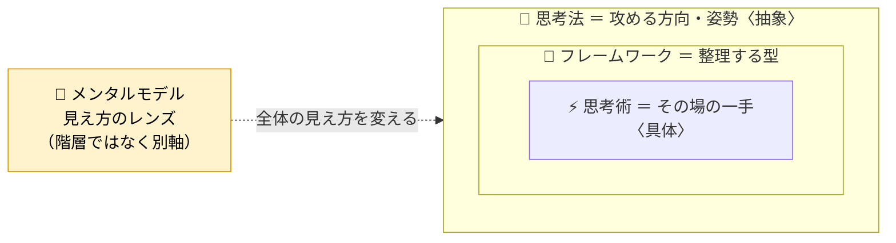

# awesome-thinking

「思考」の知識 — **メンタルモデル・思考フレームワーク・思考法・思考術** — を集めて整理するリポジトリです。4タイプの違いを定義し、項目ごとに Markdown でまとめています。

## 4タイプの違い

同じお題「**貯金ができない**」に、4タイプがそれぞれどう関わるか。

| タイプ | ひとことで | 「貯金ができない」への関わり方 | 一覧 |
| --- | --- | --- | --- |
| 🧠 メンタルモデル | 見え方を変える**レンズ** | 機会費用で捉え、*今の出費は将来の選択肢を手放すこと*と見る | [→](./mental-models/README.md) |
| 🧩 フレームワーク | 整理する**型** | なぜなぜ分析で*なぜ貯まらない? → 固定費が高い → なぜ?* と掘る | [→](./frameworks/README.md) |
| 🌊 思考法 | 攻める**方向・姿勢** | *そもそも貯金が目的? 何のため?* と前提を問い直す | [→](./thinking-methods/README.md) |
| ⚡ 思考術 | その場の**一手** | ゼロベースで*支出を白紙に戻し「ゼロから組むなら」* と考える | [→](./thinking-skills/README.md) |

4つは横並びではありません。**思考法 ⊃ フレームワーク ⊃ 思考術**（抽象→具体の入れ子）で、メンタルモデルだけは別軸の「レンズ」として全体に効きます。



詳しい比較表は ➡ **[docs/taxonomy.md](./docs/taxonomy.md)**

## 一覧

ジャンル別の一覧は上の表の「→」から。以下は全項目です。

| ジャンル | 項目 | ひとこと |
| --- | --- | --- |
| 🧠 メンタルモデル | [第一原理思考](./mental-models/first-principles.md) | 前提を疑い、根本の事実まで遡って考え直す |
| 🧠 メンタルモデル | [機会費用](./mental-models/opportunity-cost.md) | 選ぶことは、選ばなかった価値を捨てること |
| 🧠 メンタルモデル | [複利](./mental-models/compound-interest.md) | 成果が次の成果の土台になり、伸びが加速する |
| 🧠 メンタルモデル | [地図は領土ではない](./mental-models/map-is-not-the-territory.md) | モデルやデータは現実そのものではない |
| 🧠 メンタルモデル | [パレートの法則](./mental-models/pareto-principle.md) | 成果の大部分はごく一部の要因から生まれる |
| 🧩 思考フレームワーク | [SWOT分析](./frameworks/swot.md) | 強み・弱み・機会・脅威の4象限で現状を把握 |
| 🧩 思考フレームワーク | [MECE](./frameworks/mece.md) | 漏れなく重複なく分ける分類の原則 |
| 🧩 思考フレームワーク | [ロジックツリー](./frameworks/logic-tree.md) | テーマを木構造で階層的に分解する |
| 🧩 思考フレームワーク | [5W1H](./frameworks/5w1h.md) | 6つの問いで情報の漏れを防ぐ |
| 🧩 思考フレームワーク | [PDCAサイクル](./frameworks/pdca.md) | 計画→実行→評価→改善を回し続ける |
| 🧩 思考フレームワーク | [KPT](./frameworks/kpt.md) | 続ける・課題・次に試すで振り返る |
| 🧩 思考フレームワーク | [なぜなぜ分析](./frameworks/5-whys.md) | 「なぜ」を繰り返して根本原因に迫る |
| 🌊 思考法 | [ロジカルシンキング](./thinking-methods/logical-thinking.md) | 主張と根拠を筋道立てて結びつける |
| 🌊 思考法 | [クリティカルシンキング](./thinking-methods/critical-thinking.md) | 前提や根拠を吟味し、思い込みを排する |
| 🌊 思考法 | [ラテラルシンキング](./thinking-methods/lateral-thinking.md) | 前提を飛び越えて新しい発想を生む |
| 🌊 思考法 | [システム思考](./thinking-methods/systems-thinking.md) | 要素のつながり・全体構造で捉える |
| 🌊 思考法 | [デザイン思考](./thinking-methods/design-thinking.md) | 共感を起点に試作と検証で解を磨く |
| 🌊 思考法 | [仮説思考](./thinking-methods/hypothesis-thinking.md) | 仮の答えを立て、検証しながら進める |
| ⚡ 思考術 | [抽象化と具体化](./thinking-skills/abstraction-and-concretization.md) | 本質を抜き出し、別の場面に当てはめ直す |
| ⚡ 思考術 | [ゼロベース思考](./thinking-skills/zero-based-thinking.md) | 前提を白紙に戻し「今ゼロから始めるなら」と考える |
| ⚡ 思考術 | [悪魔の代弁者](./thinking-skills/devils-advocate.md) | あえて反対役になり、弱点をあぶり出す |
| ⚡ 思考術 | [リフレーミング](./thinking-skills/reframing.md) | 同じ事実を別の枠組みから捉え直す |
| ⚡ 思考術 | [極端思考](./thinking-skills/extreme-case-thinking.md) | 変数を両極端まで振り切り、本質や効きどころを浮かび上がらせる |

## ディレクトリ構成

```
README.md                  # このファイル（トップの一覧）
docs/taxonomy.md           # 4タイプの定義と違い（＋収録の受け入れ要件）
docs/out-of-scope.md       # 収録対象外（reject）リスト
mental-models/             # メンタルモデル（各項目 + 一覧 README）
frameworks/                # 思考フレームワーク
thinking-methods/          # 思考法
thinking-skills/           # 思考術
adr/                       # 意思決定の記録（yyyymmdd-<name>/ ごと）
CLAUDE.md                  # 執筆・運用方針
```

## 項目を追加するには

[CLAUDE.md](./CLAUDE.md) の「項目を追加するときの手順」とテンプレートに従ってください。
ディレクトリ・ファイル名は英語スラッグ、本文・タイトルは日本語で記載します。

## 意思決定の記録（ADR）

構成・方針・分類に関する意思決定は [`adr/`](./adr/README.md) に記録しています。
記録のルールは [CLAUDE.md の「意思決定の記録（ADR）」](./CLAUDE.md) を参照してください。
