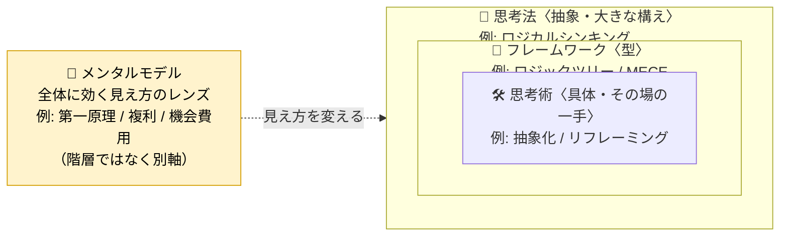

# 思考の分類と定義

このリポジトリでは「思考」に関する知識を **4つのタイプ** に分けて整理します。
これらの境界はもともと曖昧で、世間でも混同されがちです。ここでは「このリポジトリ内での定義」として線を引き、分類の拠り所とします。

## 4タイプ早見表

「問いの軸」だけでなく、**手順の有無・抽象度・使うタイミング**まで並べると違いが見えやすくなります。

| タイプ | ディレクトリ | 問いの軸 | 手順・埋める枠 | 抽象度 | 粒度 | 主に使うタイミング | ひとことで |
| --- | --- | --- | --- | --- | --- | --- | --- |
| メンタルモデル | `mental-models/` | 何が起きているか | なし（前提・視点） | 高 | 概念 | 状況を眺めるとき・常時 | 世界を理解する「レンズ」 |
| 思考フレームワーク | `frameworks/` | どう整理するか | あり（枠が明確） | 低 | 枠組み・型 | 情報を整理・分析するとき | 情報を構造化する「テンプレート」 |
| 思考法 | `thinking-methods/` | どの方向から考えるか | なし（方向だけ） | 最も高い | 流儀・スタイル | どの方向から攻めるか決めるとき | 思考全体の「考え方の流儀」 |
| 思考術 | `thinking-skills/` | どう手を動かすか | 軽い操作 | 低 | 技・操作 | その場で詰まったとき・一手打つとき | すぐ使える「コツ・テクニック」 |

**読み解き方**: 一番効くのは「**手順・埋める枠があるか**」の列です。明確な枠があれば**フレームワーク**、枠はないが見方を変えるなら**メンタルモデル**、全体の方向性を決める大きな構えなら**思考法**、その場で打てる小さな技なら**思考術**です。

## 4タイプの関係（包含関係）

4つは横並びではありません。**思考法（大きな構え）の中にフレームワーク（型）があり、その中で思考術（小さな手）を打つ**、という入れ子の関係になりがちです。メンタルモデルだけは別軸で、これら全体に「ものの見方」として効きます。

> 入れ子の3つ（思考法 ⊃ フレームワーク ⊃ 思考術）は「抽象 → 具体」の1本のグラデーション。メンタルモデルだけはこの梯子に乗らない**別軸**なので、あえて外側に黄色で分けて描いています。4タイプを L1〜L4 の通し番号で1列に並べない理由は [`adr/20260602-no-layer-numbering/`](../adr/20260602-no-layer-numbering/README.md) を参照。

> 例: 「ロジカルに考えよう（**思考法**）」と決め、「ロジックツリーで分解しよう（**フレームワーク**）」と型を選び、行き詰まったら「一段抽象化してみよう（**思考術**）」と手を打つ。その間ずっと「複利で効いているのでは（**メンタルモデル**）」というレンズが状況の見え方を変えている。

## 同じお題を4タイプで考えてみる

定義だけでは違いが掴みにくいので、**1つのお題「アプリの解約が増えている」を4タイプそれぞれで扱うとどうなるか**を並べます。同じ問題でも、関わり方がまったく違うことが分かります。

| タイプ | このお題への関わり方 | 具体例 |
| --- | --- | --- |
| 🧠 **メンタルモデル**（レンズ） | 状況の**見え方**を変える。手順はない | 「複利」のレンズ → *悪い口コミが口コミを呼び、解約が解約を呼ぶ悪循環では?* / 「機会費用」のレンズ → *ユーザーが他アプリへ移る＝こちらに留まる価値が他より低い、ということ* |
| 🧩 **フレームワーク**（型） | 決まった**枠に当てはめて整理**する | 「なぜなぜ分析」→ *なぜ解約? →使いにくい →なぜ? …* と原因を掘る / 「SWOT」→ 自社の強み・弱みと競合を4象限に書き出す |
| 🧭 **思考法**（流儀） | **どの方向・姿勢で**攻めるかを決める | クリティカルシンキング → *そもそも「増えている」は本当か? 季節要因や母数のせいでは?* と前提を疑う / システム思考 → 個々の原因でなく*獲得・継続・離脱の循環構造*で捉える |
| 🛠 **思考術**（その場の技） | **すぐ打てる一手**で詰まりを動かす | 悪魔の代弁者 → *「むしろ解約は健全な淘汰で問題ない」と反論したら?* / リフレーミング → 問いを「解約率を下げる」から*「継続したくなる理由は何か」*へ置き換える |

ポイントは、**メンタルモデルは「見え方」を、思考法は「攻める方向」を、フレームワークは「整理の型」を、思考術は「その場の一手」を与える**、ということです。実際の思考では、これらを組み合わせて使います。

---

## メンタルモデル（Mental Models）

**定義**: 世界や物事の仕組みを理解・予測するために、頭の中に持つ「縮図」「レンズ」。
現実を単純化して説明するための心的な型であり、「何が起きているか」を捉えるための静的な理解の道具。

- **特徴**: それ自体は手順を持たない。状況を見るときの視点・前提として働く。
- **典型例**: 第一原理、機会費用、複利、需要と供給、パレートの法則、地図は領土ではない、確証バイアス。
- **区別のポイント**: 「手順を踏んで使う」ものではなく「持っていると見え方が変わる」もの。

## 思考フレームワーク（Frameworks）

**定義**: 思考を構造化するための「枠組み」「テンプレート」。
決まった項目・軸に沿って情報を当てはめ、整理・分析する。再現性が高く、他者と共有・分担しやすい。

- **特徴**: 埋めるべきマス・軸が定義されている。「どう整理するか」を与える。
- **典型例**: SWOT、MECE、ロジックツリー、5W1H、PEST、4P、KPT、PDCA、なぜなぜ分析。
- **区別のポイント**: 「型に当てはめる」作業が中心。思考法（流儀）が具体的な道具に落ちたもの、と捉えると分かりやすい。

## 思考法（Thinking Methods / Approaches）

**定義**: 物事に向き合うときの「考え方の流儀・スタイル」。思考全体の方向性やモードを指す。
「どの方向から、どんな姿勢で考えるか」を決める上位の概念。

- **特徴**: 特定の枠（マス）を持たず、広く適用できる思考の構え。
- **典型例**: ロジカルシンキング、クリティカルシンキング、ラテラルシンキング、システム思考、デザイン思考、仮説思考、演繹/帰納/アブダクション。
- **区別のポイント**: フレームワークより抽象的で大きい。1つの思考法の中に複数のフレームワークが含まれることが多い（例: ロジカルシンキング ⊃ ロジックツリー / MECE）。

## 思考術（Thinking Techniques / Skills）

**定義**: 日常・実務で使える具体的な「技」「コツ」。粒度が小さく、すぐに実践できる操作レベルのテクニック。

- **特徴**: 単独で・短時間で使える。手を動かす操作に近い。
- **典型例**: 抽象化と具体化、言い換え、要約、ゼロベース思考、悪魔の代弁者、リフレーミング、タイムボックス。
- **区別のポイント**: 思考法が「構え」なら、思考術は「その場で打てる手」。最も実践寄り。

---

## 分類に迷ったときの指針

境界は曖昧なので、以下の順に問うと判断しやすくなります。

1. **手順や埋める枠があるか？** → あれば **フレームワーク**。
2. **世界の見方・前提として効くか（手順はない）？** → **メンタルモデル**。
3. **思考全体の方向性・姿勢を決める大きな構えか？** → **思考法**。
4. **その場ですぐ打てる小さな技か？** → **思考術**。

どうしても複数にまたがる場合は、最も主要な用途のディレクトリに置き、本文の「関連・補足」に他タイプとの関係を記載してください。
フロントマターの `tags` で目的・ドメイン（意思決定・問題解決・発想・分析など）を補助的に付与できます。
