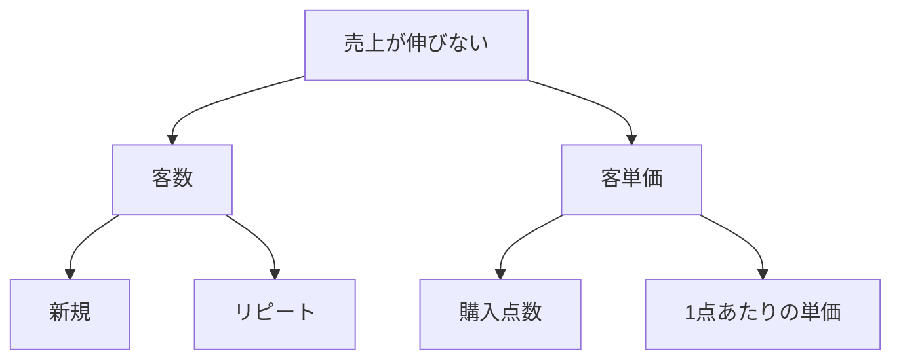

# ロジックツリー（Logic Tree）

## 一言でいうと
1つのテーマを木構造で枝分かれさせ、階層的に分解して整理する枠組み。

## 定義
上位の問い・課題を、下位の要素へと段階的に分解していくツリー状の図。各階層を MECE に分けることで、全体像と原因・打ち手を網羅的に捉える。

## 図解
「売上が伸びない」を頂点に置き、MECE な切り口で2階層に分解した例。

## 使いどころ
- 問題の原因を掘り下げたいとき（Whyツリー）。
- 打ち手を具体化したいとき（Howツリー）。
- 全体を構成要素に分けて把握したいとき（Whatツリー）。

## 使い方・手順
1. 頂点に問い・課題を置く。
2. それを MECE な切り口で2〜4個の要素に分解する。
3. 各要素をさらに同じ要領で分解する（2〜4階層が目安）。
4. 末端まで分けたら、注力すべき枝を選ぶ。

## 例
- 「売上が伸びない」→「客数」「客単価」→ 客数を「新規」「リピート」と分解し、ボトルネックを特定する。
- 「コストが高い」→「固定費」「変動費」と分け、削減余地の大きい枝を探す。
- 「離脱率が高い」→ 画面・導線ごとに分解し、どの段階で離脱が起きているか切り分ける。

## 注意点・落とし穴
- 各階層が MECE でないと、漏れや重複で結論を誤る。
- 深くしすぎると扱いきれない。目的に必要な深さで止める。

## 関連
- [mece](./mece.md)（MECE）
- [5-whys](./5-whys.md)（なぜなぜ分析）— 原因の縦掘りに近い。
- [decision-matrix](./decision-matrix.md)（意思決定マトリクス）— 評価軸から評価項目への分解に木構造の分解を使う。
- [pareto-principle](../thinking-mental-models/pareto-principle.md)（パレートの法則）
- [so-what-why-so](../thinking-skills/so-what-why-so.md)（So What? / Why So?）— 木の各縦のつながりが飛躍していないかを点検する。
