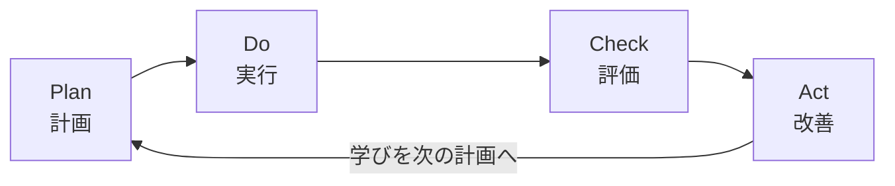

# PDCAサイクル（PDCA Cycle）

## 一言でいうと
計画→実行→評価→改善を回し続け、継続的に良くしていく枠組み。

## 定義
Plan（計画）/ Do（実行）/ Check（評価）/ Act（改善）の4段階を繰り返すマネジメントサイクル。各周回で学びを次の計画に反映する。

## 図解
4段階は一巡で終わりではなく、Act の学びを次の Plan に渡して回し続ける。

## 使いどころ
- 業務・習慣・施策を継続的に改善したいとき。
- 試して学ぶことを仕組みとして回したいとき。

## 使い方・手順
1. **Plan**: 目標と、達成のための具体策・指標を決める。
2. **Do**: 計画を小さく実行し、記録を取る。
3. **Check**: 結果を指標で評価し、計画とのズレと原因を見る。
4. **Act**: 改善点を次の Plan に反映し、サイクルを回す。

## 例
- ブログの更新頻度を上げる施策で、週次にPVを測り（Check）、書く時間帯を見直す（Act）。
- 営業トークの改善で、計画→実施→受注率の確認→台本の修正、を月次で回す。
- ダイエットで、目標設定→実行→体重の記録→食事や運動の調整、を繰り返す。

## 注意点・落とし穴
- Plan に時間をかけすぎて回り始めない「PDPD」になりがち。まず小さく回す。
- 変化の速い領域では、より速い OODA ループや仮説検証が向く場合もある。

## 関連
- [kpt](./kpt.md)（KPT）— Check/Act の振り返りに使える。
- [hypothesis-thinking](../thinking-methods/hypothesis-thinking.md)（仮説思考）
