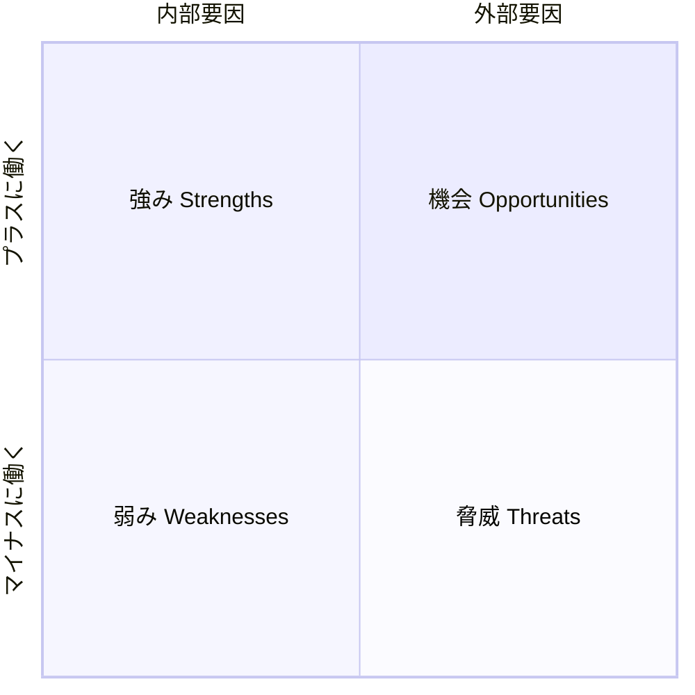

# SWOT分析（SWOT Analysis）

## 一言でいうと
強み・弱み・機会・脅威の4象限に情報を整理し、戦略の現状を把握する枠組み。

## 定義
内部要因（Strengths 強み / Weaknesses 弱み）と外部要因（Opportunities 機会 / Threats 脅威）の4つに情報を分類して、置かれた状況を俯瞰するフレームワーク。

## 図解
横軸に内部か外部か、縦軸にプラスに働くかマイナスに働くかを取ると、4象限がそのまま S/W/O/T に対応する。

## 使いどころ
- 事業・プロダクト・個人のキャリアなどの現状分析。
- 戦略立案の出発点として全体像を共有したいとき。

## 使い方・手順
1. 分析の対象と目的を1つに定める（曖昧だと使えない）。
2. 内部の強み・弱みを書き出す。
3. 外部環境の機会・脅威を書き出す。
4. 4象限を掛け合わせて戦略を導く（強み×機会＝攻め、弱み×脅威＝守り など。クロスSWOT）。

## 例
- 自社プロダクトを、強み（技術力）／弱み（知名度不足）／機会（市場拡大）／脅威（新規参入）の4象限で整理する。
- 転職活動で、自分のスキル・経験不足・求人増・競合の応募者を棚卸しして戦略を立てる。
- 店舗出店の検討で、立地の強み・資金の弱み・商圏の機会・競合店の脅威を一覧化する。

## 注意点・落とし穴
- 列挙して終わりにしがち。クロス分析で戦略に落とすまでやる。
- 「強み/機会」の切り分けが主観的になりやすい。事実で裏づける。

## 関連
- [mece](./mece.md)（MECE）— 漏れ・ダブりなく書き出すために併用。
- [logical-thinking](../thinking-methods/logical-thinking.md)（ロジカルシンキング）
