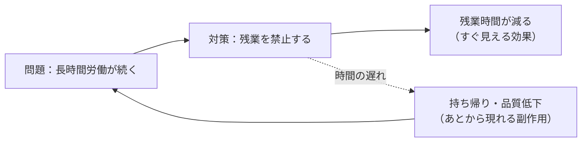

# システム思考（Systems Thinking）

## 一言でいうと
物事を個別の点ではなく、要素のつながり・全体の構造として捉える流儀。

## 定義
要素間の相互作用・因果のループ・時間遅れに注目し、システム全体の振る舞いから問題を理解しようとする思考のスタイル。部分最適ではなく全体の構造を見る。

## 図解
対策のすぐ見える効果の裏で、時間の遅れをともなう副作用が元の問題に戻ってくるループの例。

## 使いどころ
- 対症療法が効かず、問題がぶり返すとき。
- 関係者・要因が複雑に絡み合っているとき。
- 施策の副作用や長期的影響を見たいとき。

## 考え方のポイント
- 因果を一方向でなく「ループ」（フィードバック）で捉える。
- 原因と結果の間の「時間の遅れ」を意識する。
- 目に見える出来事の下にある「構造・前提」に注目する。

## 例
- 「残業を禁止」→ 一時的に残業は減るが、仕事量が変わらなければ持ち帰りや品質低下に回る、と全体の挙動を読む。
- 「在庫を増やす」→ 欠品は減るが、保管コストと廃棄が増えるという連鎖を見る。
- 「価格を下げる」→ 短期は売れるが、値引き前提の客が定着しブランド価値が下がる構造を読む。

## 注意点・落とし穴
- 全体を見ようとして分析が複雑になりすぎる。注目するループを絞る。
- 「すべてつながっている」で思考停止しない。介入点（レバレッジポイント）を探す。

## 関連
- [compound-interest](../thinking-mental-models/compound-interest.md)（複利）— フィードバックループの一例。
- [map-is-not-the-territory](../thinking-mental-models/map-is-not-the-territory.md)（地図は領土ではない）
- [birds-worms-fish-eye](../thinking-skills/birds-worms-fish-eye.md)（虫の目・鳥の目・魚の目）— 鳥の目・魚の目を大きな構えとして体系化した思考法。
- [center-pin](../thinking-mental-models/center-pin.md)（センターピン）— つながりの中で「波及の起点」を一点に見いだすレンズ。
