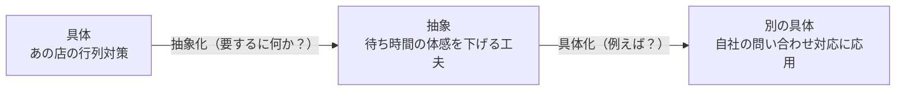

# 抽象化と具体化

## 一言でいうと
具体的な事象から本質を抜き出し（抽象化）、本質を別の場面に当てはめ直す（具体化）、その往復の技。

## 定義
- **抽象化**: 個別の事例から、共通する本質・パターン・構造を取り出すこと。
- **具体化**: 抽象的な概念を、特定の状況・例・行動に落とし込むこと。
この2つを行き来することで、応用・転用・伝達ができるようになる。

## 図解
目の前の具体から本質を抜き出し、それを別の場面に当てはめ直す往復。

## 使いどころ
- ある分野の成功例を別の分野に応用したいとき。
- 話が「具体的すぎて広がらない／抽象的すぎて伝わらない」とき。
- 本質を掴んで一段上の理解に到達したいとき。

## 使い方・手順
1. 目の前の事例から「要するに何か」を一言で言ってみる（抽象化）。
2. その本質に「例えば？」と問い、別の具体例を出す（具体化）。
3. 抽象と具体を往復し、ちょうど良い高さで言語化する。

## 例
- 「あの店の行列対策（具体）」→「待ち時間の体感を下げる工夫（抽象）」→「自社の問い合わせ対応に応用（別の具体）」。
- 「特定のバグ修正（具体）」→「入力検証の不足という構造（抽象）」→「他の入力箇所も総点検（別の具体）」。
- 「ある成功事例（具体）」→「成功要因のパターン（抽象）」→「別の事業への横展開（別の具体）」。

## 注意点・落とし穴
- 抽象化しすぎると当たり前で中身のない話になる。
- 具体だけだと応用が利かない。常に往復させるのがコツ。

## 関連
- [first-principles](../thinking-mental-models/first-principles.md)（第一原理思考）
- [reframing](./reframing.md)（リフレーミング）
- [naming](./naming.md)（命名）— 抽象化で抜き出した本質に名前をつけると扱いやすくなる。
- [birds-worms-fish-eye](./birds-worms-fish-eye.md)（虫の目・鳥の目・魚の目）— 鳥の目⇔虫の目の往復が抽象⇔具体に対応する。
- [analogical-reasoning](../thinking-methods/analogical-reasoning.md)（アナロジー思考）— 抽象化で抜き出した本質を別領域に写す土台になる。
