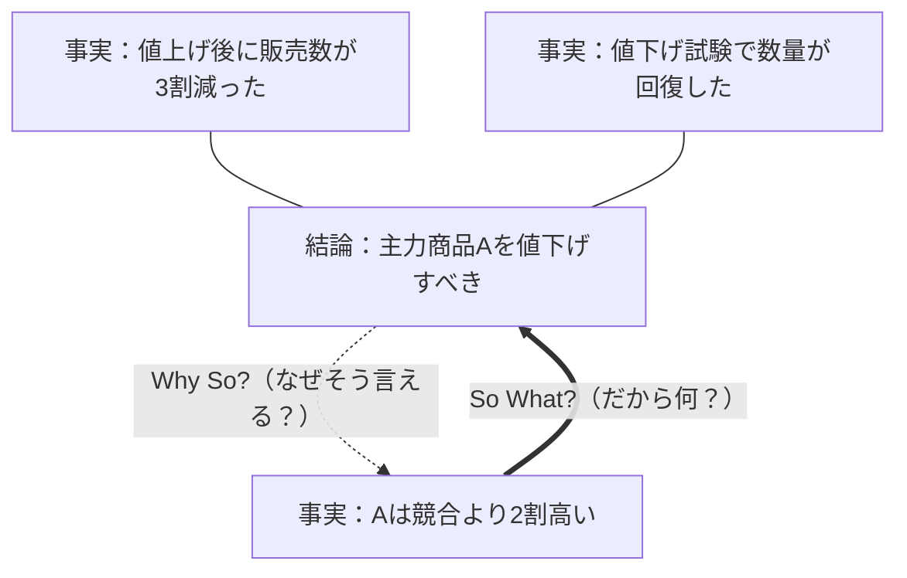

# So What? / Why So?（So What? / Why So?）

## 一言でいうと
手元の材料に「だから何が言える？」（So What?）と問って上位の結論を絞り出し、その結論に「なぜそう言える？」（Why So?）と問って根拠へ降ろす、上下2方向の問いかけの技。

## 定義
- **So What?（だから何？）**: 複数の事実・データから「結局、何が言えるのか」という一段上のメッセージを抜き出す（下から上への集約・抽象化）。
- **Why So?（なぜそう言えるのか）**: ある主張・結論に対して「なぜそう言えるのか」という根拠・裏づけを示す（上から下への展開・具体化）。

この2つは同じ縦のつながりを逆向きにたどる対の操作で、片方で組み立て、もう片方で検算する。結論と根拠の飛躍（論理の飛び）を洗い出すために使う。バーバラ・ミント『考える技術・書く技術』のピラミッド構造で整理され、日本では照屋華子・岡田恵子『ロジカル・シンキング』で広く知られるようになった、というのが整理の一つ。

## 図解
結論と根拠のあいだの1本の縦線を、So What? は下から上へ、Why So? は上から下へたどる。

## 使いどころ
- 資料や提案を「結論→根拠」の筋で組み立て、説明の飛躍をなくしたいとき。
- 集めたデータから「で、結局何が言えるのか」を1行のメッセージに落としたいとき。
- 他人の主張を聞いて、根拠が結論を本当に支えているかを点検したいとき。

## 使い方・手順
1. 手元の事実・データを並べ、「これらから**だから何が言える？**」（So What?）と問い、一段上の結論を1文で書く。
2. 書いた結論に「**なぜそう言える？**」（Why So?）と問い、根拠が過不足なく結論を支えているかを確かめる。
3. 支えきれていなければ、結論を弱める・事実を足す・切り口を変えるのいずれかで直す。
4. 結論→根拠→事実の各段で1と2を往復し、縦のつながりに飛躍がない状態にする。

## 例
- 事実「Aは競合より2割高い」「値上げ後に販売数が3割減」→ So What?「価格が売上の重しになっている」→ Why So? で「他要因（季節・在庫）で説明できないか」を点検し、飛躍がないか確かめる。
- 会議で「若手が辞めている」という報告に Why So? を当て、「なぜそう言える？」（=何人が、どの層が、いつ）と根拠を確認する。
- 調査結果の各グラフに So What? を当て、「このグラフだから何が言える？」を1行ずつ書き、最後にそれらをまた So What? で束ねて全体の結論にする。

## 注意点・落とし穴
- So What? の答えが「事実の要約」で止まりがち。「A社は高い」ではなく「だから打ち手はこうだ」まで踏み込んで初めて So What? になる。
- Why So? は**根拠（そう言える裏づけ）**を問うもので、**原因（なぜ起きたか）**を問う[なぜなぜ分析](../thinking-frameworks/5-whys.md)とは別物（下の「似ている用語との違い」参照）。
- 都合のよい事実だけで Why So? を通すと、もっともらしいだけの結論になる。反証も当てる（[悪魔の代弁者](./devils-advocate.md)）。

## 似ている用語との違い
名前も見た目も似ていて最も混同されやすいのが「なぜ」を問う[なぜなぜ分析](../thinking-frameworks/5-whys.md)。両者の「なぜ」は問うている対象が違う。

- **なぜなぜ分析（5 Whys）** — 似ている点：どちらも「なぜ？」を問う。決定的な違い：なぜなぜ分析の「なぜ」は**原因（因果）**を問い、ある事象がなぜ*起きたか*を時間をさかのぼって掘る。Why So? の「なぜ」は**根拠（論証）**を問い、ある主張がなぜ*そう言えるか*の裏づけを確かめる。前者は真因の特定、後者は論理の妥当性の検証が目的。
- **抽象化と具体化（Abstraction and Concretization）** — 似ている点：So What? は上への抽象化、Why So? は下への具体化に対応し、上下の往復という骨格が同じ。違い：抽象化と具体化は本質を抜き出して**別の場面へ転用**することが主眼で、横（別領域）へ広がる。So What? / Why So? は同じ論の**縦のつながりの検証**に閉じる。

### どちらを優先するか（なぜなぜ分析との使い分け）
両者は競合しない。異なる問いに答える道具なので、**やっていることで選ぶ**。

- **問題の原因を突き止めたい**（トラブル対応・再発防止）→ [なぜなぜ分析](../thinking-frameworks/5-whys.md)。
- **主張の筋道を組み立て・検証したい**（資料作成・説明・提案）→ So What? / Why So?。

同じ問いに両方を当てると混乱する。例えば「売上が落ちた」に対し、なぜなぜ分析は原因（競合が値下げした）を掘るが、Why So? は「売上が落ちた」という主張の根拠（月次の売上データ）を問う。根拠を確かめたい場面で原因を掘り始めると、論の検証のつもりが原因究明にすり替わる。まず「いま原因が知りたいのか、根拠を確かめたいのか」を決めてから道具を選ぶ。

## 関連
- [logical-thinking](../thinking-methods/logical-thinking.md)（ロジカルシンキング）— 主張と根拠を結ぶこの流儀の中核で使う往復の技。
- [logic-tree](../thinking-frameworks/logic-tree.md)（ロジックツリー）— 縦に分解した木の各つながりを So What? / Why So? で点検する。
- [abstraction-and-concretization](./abstraction-and-concretization.md)（抽象化と具体化）— 上下の往復という骨格を共有する。
- [5-whys](../thinking-frameworks/5-whys.md)（なぜなぜ分析）— 「なぜ」が似るが、原因を問う点で別物（使い分けは上記）。
